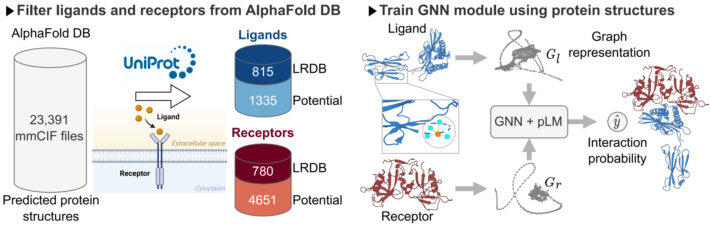
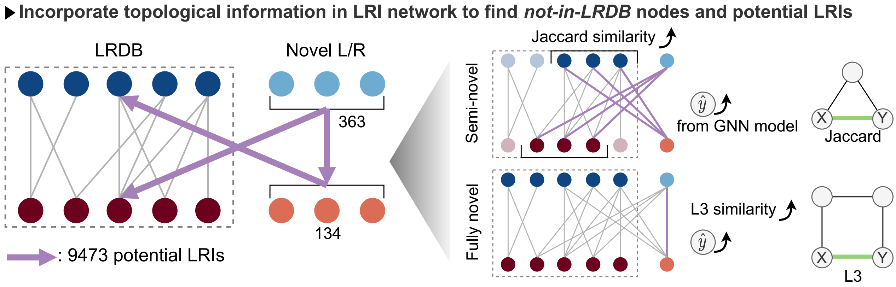
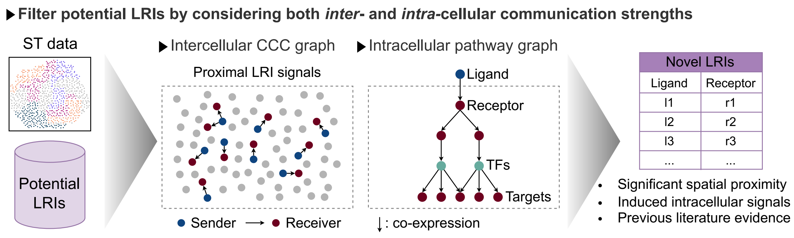

<br/>
<h1 align="center">AlphaTalk</h1>
<br/>

AlphaTalk incorporates protein structures to grain deeper cell-cell communication insights.
The framework is composed of three modules, including 
1. GNN-based LRI predictor in `gnn_predictor/`
2. LRI network-based algorithms in `network_algorithms/`
3. Spatial transcriptomics filtering in `st_filtering/`

The first two modules use GNN methods and network-based algorithms to generate novel LRIs for Human and Mouse.
The results are stored in `lr_novel.csv` and `lr_novel_mouse.csv`, both located in `st_filtering/data/`.
ST filtering is employed to filter reliable novel LRIs based on two criteria: 
spatial proximity and the ability to activate downstream intracellular signaling transduction.

## 🚀 Dependencies
Clone the repository and create a new `alphatalk` environment.
```
git clone https://github.com/deepomicslab/AlphaTalk.git
cd AlphaTalk
conda env create --file alphatalk.yml
conda activate alphatalk
pip install transformers SentencePiece
```

## 🚀 GNN-based LRI predictor
<br/>
<p align="center">
    
</p>
<br/>


This module generates the interacting probability of all combinations of ligands and receptors in `df_potential_lr.csv`.
The results are finally saved in `network_algorithms/lr_database_raw.csv`.
Please refer to the instructions below to generate the results yourself *or*
access the paper version of the results deposited on [Google drive].

[Google drive]: https://drive.google.com/drive/folders/1t9GY5f71caerbKH4BvWZ-_XC-S5Q8xBF?usp=sharing

### 📁 Data details
- 📁 `data/` 
  - 📁 `source/`
    - `human_v4/` Predicted *human* protein structures from [AlphaFold DB](https://alphafold.ebi.ac.uk/download).
    - `human_v4.fasta` Amino acid sequences of proteins in `human_v4/`.
    - `human_v4_ProtT5/` Generated [ProtT5](https://github.com/agemagician/ProtTrans) embeddings for proteins in `human_v4.fasta`.
  - 📁 `df/`
    - `lrpairs.tsv` LRDB records retrieved from [SpaTalk](https://github.com/ZJUFanLab/SpaTalk).
    - `df_potential_lr.csv` Classified ligands and receptors in `human_v4/` with "origin" columns indicating whether the protein is novel (not in LRDB).
      "c": LRDB; "u": novel.
    - `df_human_dataset_nfold1.csv` The LRI dataset with positive and negative samples.
  - 📁 `graph/`
    - `human_v4_6_alpha.pt` A list composed of [pyg graph](https://pytorch-geometric.readthedocs.io/en/latest/generated/torch_geometric.data.Data.html#torch_geometric.data.Data) objects.

### 📄 Train the model and predict novel LRIs
1. 📁 (*Optional*) Download predicted *human* protein structures from [AlphaFold DB](https://alphafold.ebi.ac.uk/download) and extract mmCIF files to `data/source/human_v4`.
2. 📁 (*Optional*) Run `generate_data.py` to transform protein structures in `human_v4/` into [pyg graph](https://pytorch-geometric.readthedocs.io/en/latest/generated/torch_geometric.data.Data.html#torch_geometric.data.Data) objects.
3. 📦 Download the graph objects from [Google drive] and put it under `data/graph/`.
4. ⚙ Run `prott5_embedding.py` to generate [ProtT5](https://github.com/agemagician/ProtTrans) embeddings for proteins in `data/source/human_v4.fasta`.
5. ⚙ Run `train_gnn_pair.py` to train the GNN model. 
6. ⚙ Run `get_lr_database.py` to Predict the interacting probability for all possible combinations of ligands and receptors.


## 🚀 Network-based algorithms
<br/>
<p align="center">
    
</p>
<br/>

This module uses the topological information in LRDB to filter the predicted LRIs in `lr_database_raw.csv` (deposited in [Google drive]). 
The results are saved in `lr_novel.csv` and `lr_novel_mouse.csv` under `st_filtering/data/`.
The "type" column indicates whether the ligand, receptor, or both are novel.

- ⚙ `filter_novel.py` Filter the predicted LRIs. The intermediate results are saved in `result/`.
- 🧬 `convert_gene_symbol.py` Transform the human genes in the potential LRIs to their mouse orthologs.
- 📊 `analysis.ipynb` Plot the results of `filter_novel.py`.


## 🚀 Spatial transcriptomics filtering

<br/>
<p align="center">
    
</p>
<br/>

This module uses single-cell spatial transcriptomics data to filter novel LRIs in `lr_novel.csv` and `lr_novel_mouse.csv` under `st_filtering/data/`.

### Perform ST filtering


- ⚙ `ccc.py` Perform the ST filtering with the following arguments:
  - **st_file** (*str*): Path of the single-cell ST data in [AnnData](https://anndata.readthedocs.io/en/latest/) format.
  The expected format of anndata is described in the notebook in `analysis_script/`.
  The example PDAC dataset is given, and others can be downloaded from [Google drive].
  - **species** (*str, optional*): Species of the ST data; currently only support {`'Human'`, `'Mouse'`}. (default: `'Human'`)
  - **tmp_dir** (*str, optional*): Root directory of the results. (default: `./tmp/`)
  - **job_name** (*str, optional*): Job name. (default: `job1`)
  - **parallel** (*bool, optional*): Whether to use multiprocessing. (default: `False`).
  - **n_core** (*int, optional*): The number of processes; only works when parallel is `True`. (default: `4`)
  - **filtering** (*str, optional*): Method for calculating valid expression count threshold; 
  choose one from {`'median'`, `'mean'`, `'null'`}. (default: `'mean'`)
  - **dist_thd** (*bool, optional*): Whether to use the 95% quantiles of distance to filter cell neighbors. (default: `True`)
  - **lrdb** (*bool, optional*): Whether to use LRIs from LRDB in conjunction with the novel LRIs. (default: `True`)

```
cd st_filtering
python ccc.py --st_file ./ST_dataset/pdac/pdac_sc_st.h5ad --job_name pdac --parallel 
```

- 📊 `analysis_script/` Analyze the CCC results. 

